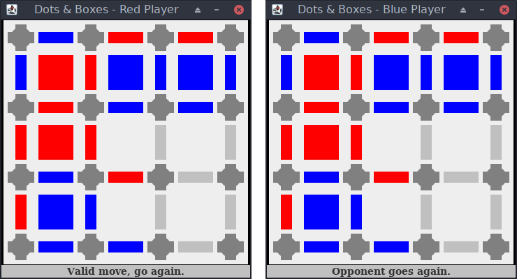

# Dots and Boxes
A simple client/server version of the game Dots and Boxes written in Java. The game starts with a simple grid, and the players take turns adding horizontal or vertical lines. A player earns a point and an extra turn when they complete the fourth side of a 1x1 square. Once all squares on the grid have been completed, the player with the most points wins.

Once the server application has started, players on the same network as the server can play against each other. Each game can only have two players, but the server can handle multiple games running concurrently.


## Usage
Compile the client and server applications:

```bash
javac Client.java Server.java
```
The server application must be running before any client attempts to connect to it. The player can provide the IP address of a server on the same local area network, or the client application can connect to localhost by default.

```bash
java Server

java Client [Server IP Address]
```


## Screenshot
<p align="center"></p>
